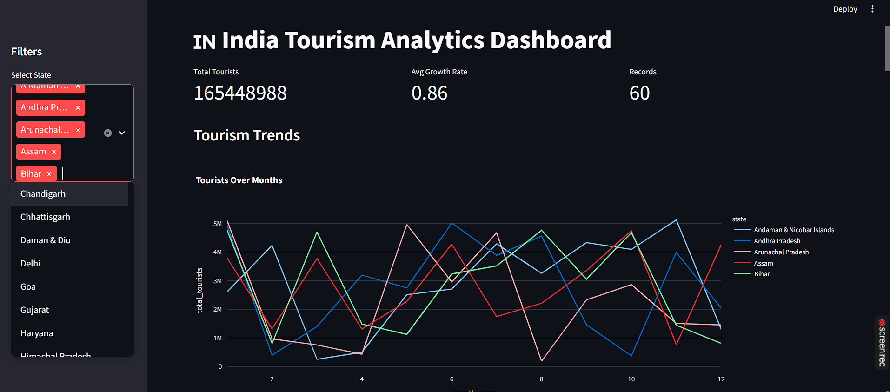

# 🇮🇳 India Tourism Analytics Dashboard

Hey!
This project started as an idea to build something more than just a typical ML notebook — I wanted to create a **complete end-to-end system** that actually feels like a real product.


---

## What this project does

It automatically:

* Fetches tourism data from Kaggle
* Cleans and processes the data
* Creates useful features (like growth rate, trends)
* Trains a machine learning model
* Shows everything in an interactive dashboard
* Predicts future tourism trends

---

## Why I built this

Most projects stop at “train a model and print accuracy.”

I wanted to go further and build something that:

* Feels like a **real-world data product**
* Can be **interacted with**
* Shows insights, not just numbers

---

## Dashboard Features

* Filter by state
* Compare multiple states
* Interactive charts (Plotly)
* State rankings
* Smart insights (top state, fastest growth)
* “Best state to visit” recommendation
* Future predictions using ML
* Simple query box (ask things like *“top 5 states”*)

---

## Tech Stack

* **Python**
* **Pandas, NumPy** → data processing
* **Scikit-learn** → ML model
* **Streamlit** → dashboard
* **Plotly** → visualizations
* **Kaggle API** → data ingestion

---

## Project Structure

```bash
india_tourism_ml/
│
├── data/
├── src/
├── dashboard/
├── models/
├── main.py
└── requirements.txt
```

---

##  How to run this project

```bash
pip install -r requirements.txt
python main.py
streamlit run dashboard/app.py
```

---

## Preview

*(Add your dashboard screenshot here 👇)*

```

```

---

##  What I learned

* Building a **complete ML pipeline**, not just models
* Handling real-world issues like **data inconsistencies**
* Structuring projects like production systems
* Making data actually **useful and interactive**

---

## Future improvements

* Deploy this online 🌐
* Add a proper AI chatbot
* Improve forecasting with advanced models
* Allow users to upload their own dataset

---

## 🙌 Final thoughts

This project was more about **learning how real systems work** than just writing code.

If you have any feedback or ideas, I’d love to hear them!

---
